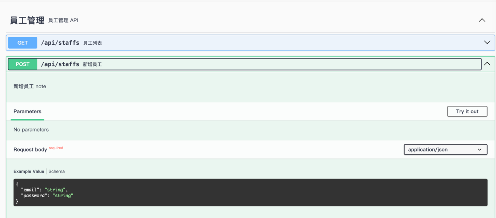
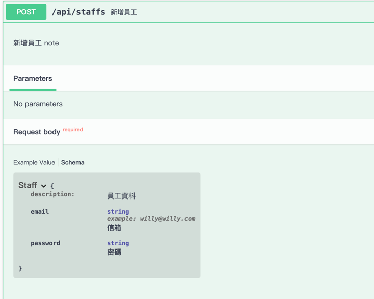
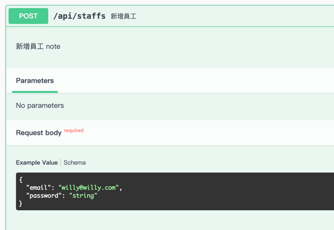

http://localhost:8080/v3/api-docs

http://localhost:8080/swagger-ui/index.html

```xml
<dependency>
    <groupId>org.springdoc</groupId>
    <artifactId>springdoc-openapi-starter-webmvc-ui</artifactId>
    <version>2.5.0</version>
</dependency>
```

---

```java
@Controller
public class SwaggerRedirectController {

    @GetMapping(value = { "/", "/swagger-ui", "/swagger-ui/" })
    @ResponseStatus(HttpStatus.MOVED_PERMANENTLY)
    public RedirectView redirect() {
        return new RedirectView("/swagger-ui/index.html");
    }
}
```

---


```java
@Tag(name = "員工管理", description = "員工管理 API")
@RestController
@RequestMapping(value = "/api/staffs")
public class StaffController {

    @Operation(summary = "員工列表")
    @GetMapping
    public List<Staff> findAll() {
        return List.of(new Staff(), new Staff());
    }

    @Operation(summary = "新增員工", description = "新增員工 note")
    @PostMapping()
    public Staff addStaff(@RequestBody Staff s) {
        return s;
    }

    @Hidden
    @DeleteMapping(value = "/{id}")
    public void deleteStaff(@PathVariable Integer id) {
    }

}
```


```java
import io.swagger.v3.oas.annotations.media.Schema;
import lombok.Data;

@Data
@Schema(description = "員工資料")
public class Staff {

    @Schema(example = "willy@willy.com", description = "信箱")
    private String email;
    @Schema(description = "密碼")
    private String password;

}
```